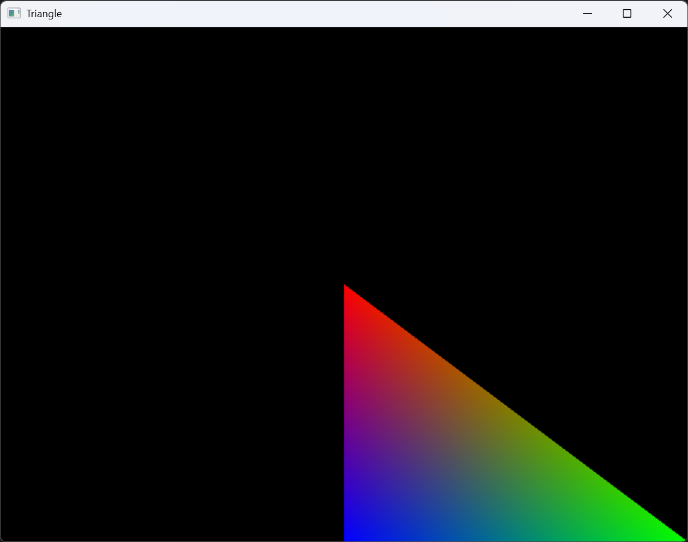
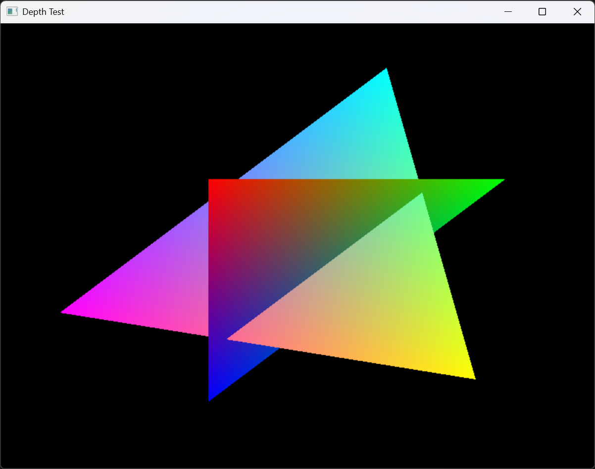
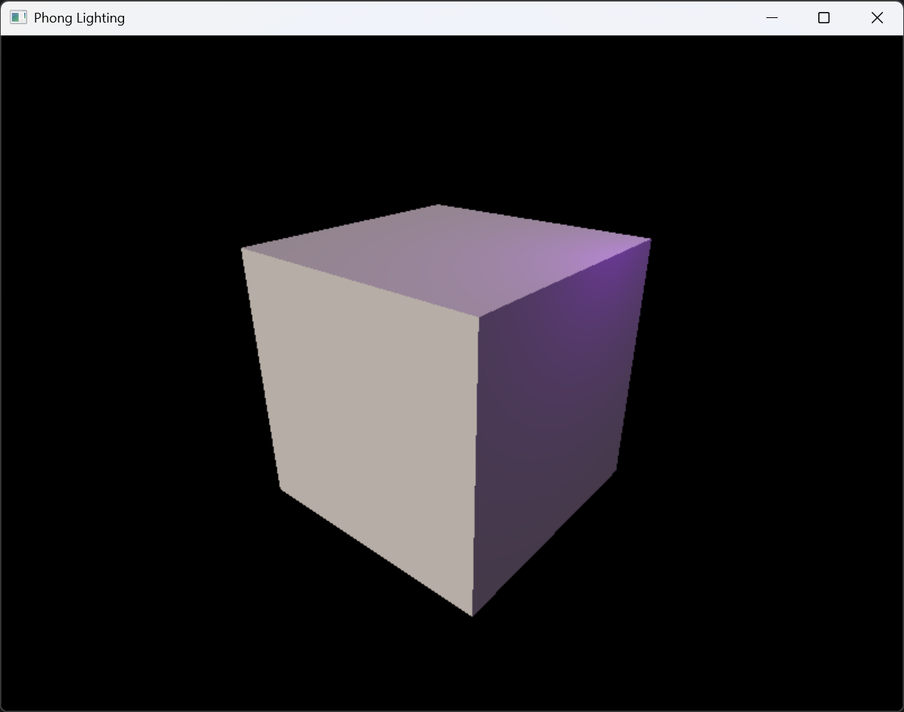

# SRDR - Soft Renderer

SRDR (Soft Renderer) 是一个基于 CPU 软件光栅化实现的 3D 图形渲染器，使用 C++20 标准编写，无第三方依赖。项目以学习为目的，完整实现了现代图形管线的主要阶段，适用于学习渲染管线原理和计算机图形学基础。

## 功能特性

- **可编程着色器管线**：支持用户自定义顶点着色器 (`VertexShaderProgram`) 和片元着色器 (`FragmentShaderProgram`)，以 `std::function` 形式注入渲染管线。
- **完整渲染管线**：实现了顶点加载 (Vertex Loading)、顶点着色 (Vertex Shading)、图元组装 (Primitive Assembling)、光栅化 (Rasterization)、片元着色 (Fragment Shading)、输出合并 (Output Merging) 等完整阶段。
- **深度测试**：支持基于逐片元的深度测试 (Depth Test)，可启用或关闭。
- **Alpha 混合**：支持透明片元的 Alpha 混合 (Blend)，可启用或关闭。
- **透视投影**：内建透视投影矩阵与视图矩阵生成，支持 `Camera` 类管理视口变换。
- **光照模型**：内置方向光 (`DirectionalLight`) 和点光源 (`PointLight`) 数据结构，配合自定义片元着色器可实现 Phong 光照模型。
- **数学库**：包含 `Vec2`/`Vec3`/`Vec4` 向量、`Mat3`/`Mat4` 矩阵、`Color` 颜色、`Transform` 空间变换等基础数学组件。
- **多种示例**：提供 6 个示例程序，覆盖窗口测试、三角形绘制、深度测试、混合、透视投影、Phong 光照，详见 [示例文档](docs/examples/index.md)。

| 窗口测试 | 三角绘制 | 深度测试 |
| :---: | :---: | :---: |
|  |  |  |

| 混合 | 透视投影 | 冯氏光照 |
| :---: | :---: | :---: |
|  |  |  |

## 系统要求

| 项目 | 要求 |
| -------- | ------------------------- |
| 操作系统 | Windows 7 及以上 (x86/x64)，其他平台待扩展 |
| 编译器 | 支持 C++20 的编译器 |
| 构建工具 | CMake 3.7 及以上 |
| 运行时 | Windows 下依赖 Windows GDI (系统自带)，平台抽象层支持扩展 |

## 快速开始

```powershell
git clone https://github.com/shangguan2024/srdr.git
cd srdr
cmake -B build -S src
cmake --build build
build\application\Debug\srdr.exe
```

## 配置说明

### CMake 配置选项

项目通过 CMake 管理构建，所有配置在 `src/CMakeLists.txt` 中定义：

- `CMAKE_CXX_STANDARD`：固定为 `20`，需要编译器支持 C++20。
- 平台宏定义：Windows 平台自动定义 `SRDR_SYSTEM_WINDOWS` 预处理宏。
- 输出目录结构：
  - `srdr_core`：静态库，基础数学与数据结构。
  - `srdr_platform`：静态库，平台窗口抽象层。
  - `srdr_renderer`：静态库，渲染管线核心。
  - `srdr`：可执行文件，主程序入口与示例。

## 目录结构

```plaintext
srdr/
├── .clang-format              # 代码风格配置文件
├── .gitignore                 # Git 忽略规则
├── LICENSE                    # MIT 许可证
├── README.md                  # 本文件
├── assets/                    # 资源
├── docs/                      # 文档
└── src/
    ├── CMakeLists.txt         # 顶层 CMake 构建入口
    ├── core/                  # 核心数学与数据结构库 (srdr_core)
    │   ├── CMakeLists.txt
    │   ├── Color.hpp/cpp      # RGBA 颜色类型
    │   ├── Vector.hpp         # Vec2/Vec3/Vec4 向量模板
    │   ├── Matrix.hpp         # Mat3/Mat4 矩阵模板
    │   ├── Transform.hpp/cpp  # 空间变换 (透视/视图/旋转/平移)
    │   └── Geometry.hpp/cpp   # 平面方程、AABB 等几何工具
    ├── platform/              # 平台抽象层 (srdr_platform)
    │   ├── CMakeLists.txt
    │   ├── IWindow.hpp           # 窗口接口
    │   ├── Win32Window.hpp/cpp   # Windows 平台实现 (Win32 GDI)
    │   └── WindowFactory.hpp/cpp # 窗口工厂
    ├── renderer/                 # 渲染管线 (srdr_renderer)
    │   ├── CMakeLists.txt
    │   ├── Renderer.hpp/cpp   # 渲染器主类
    │   ├── stage/             # 渲染管线各阶段
    │   │   ├── VertexLoader.hpp/cpp       # 顶点加载
    │   │   ├── VertexShader.hpp/cpp       # 顶点着色器
    │   │   ├── PrimitiveAssembler.hpp/cpp # 图元组装 (裁剪/视口变换)
    │   │   ├── Rasterizer.hpp/cpp         # 光栅化
    │   │   ├── FragmentShader.hpp/cpp     # 片元着色器
    │   │   └── OutputMerger.hpp/cpp       # 输出合并 (深度/混合)
    │   ├── shader_interfaces/ # 着色器接口数据结构
    │   │   ├── Vertex.hpp     # Vertex/VertexInput/VertexOutput
    │   │   ├── Fragment.hpp   # FragmentInput/FragmentOutput
    │   │   ├── Primitive.hpp  # Primitive/ScreenVertex/EdgeEquation
    │   │   ├── FrameBuffer.hpp/cpp     # 帧缓冲
    │   │   ├── ColorAttachment.hpp/cpp # 颜色附件
    │   │   └── DepthAttachment.hpp/cpp # 深度附件
    │   └── scene/             # 场景管理
    │       ├── Camera.hpp/cpp # 相机 (视图/投影矩阵)
    │       └── Light.hpp      # 光源类型 (方向光/点光)
    └── application/           # 应用程序与示例 (srdr)
        ├── CMakeLists.txt
        ├── app.cpp            # 主程序入口与菜单
        └── examples/          # 示例程序
            ├── ExampleWindowTest.hpp/cpp
            ├── ExampleDrawTriangle.hpp/cpp
            ├── ExampleDepthTest.hpp/cpp
            ├── ExampleBlend.hpp/cpp
            ├── ExamplePerspectiveProjection.hpp/cpp
            └── ExamplePhongLighting.hpp/cpp
```

### 编码规范

- 遵循 `.clang-format` 中定义的代码风格（基于 LLVM，缩进 4 空格，列宽 100）。
- **命名空间**：小写，嵌套使用 `::` 连接（`srdr`、`srdr::transform`、`detail`）。
- **类与结构体**：PascalCase（`Renderer`、`Color`、`VertexShader`）。
- **方法与自由函数**：camelCase（`getViewMatrix`、`enableDepthTest`、`perspective`）。
- **成员变量**：`m_` 前缀 + snake_case（`m_window`、`m_vertex_buffer`）。
- **宏**：UPPER_CASE（`SRDR_SYSTEM_WINDOWS`）。
- 所有公共接口位于 `srdr` 命名空间下。
- 使用 C++20 标准特性，避免平台相关 API 泄漏至公共接口。
