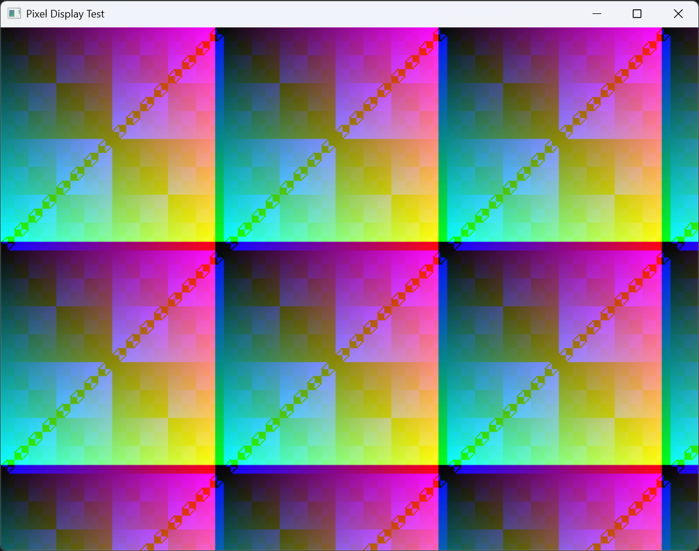

# WindowTest 示例

## 概述

WindowTest 是 SRDR 最基础的示例，演示窗口创建、像素缓冲区操作以及将像素数据显示到窗口的全过程。渲染结果通过平台无关的 `IWindow` 接口输出，当前基于 Win32 GDI 实现。该示例不依赖渲染管线，直接操作帧缓冲区内存。

## 运行效果



运行后将显示一个 `800x600` 的窗口，窗口内容为动态生成的彩色条纹图案，每帧颜色沿 X 和 Y 方向渐变，并随时间产生滚动效果。

## 核心流程

```plaintext
[创建窗口] -> [分配像素缓冲区] -> [循环: 填充像素 -> 显示到窗口]
```

### 1. 窗口创建

使用 `WindowFactory` 创建平台窗口实例：

```cpp
WindowFactory wf;
auto window = wf.createWindow();
window->create(800, 600, "Pixel Display Test");
```

`WindowFactory::createWindow` 返回 `std::shared_ptr<IWindow>` 接口指针，屏蔽了底层平台差异。Windows 平台下创建的是 `Win32Window` 对象，其 `create` 方法执行以下操作：

1. 注册窗口类 (`WNDCLASSEXA`)
2. 创建窗口并计算客户区尺寸
3. 创建 DIB Section 作为像素缓冲区
4. 创建兼容内存 DC
5. 显示窗口

其他平台可通过继承 `IWindow` 接口实现对应的窗口创建逻辑，上层代码无需修改。

### 2. 像素填充

在渲染循环中，直接操作 `std::vector<uint32_t>` 缓冲区，每个像素使用 `0xAARRGGBB` 格式编码：

```cpp
std::vector<uint32_t> framebuffer(width * height);

while (window->isRunning()) {
    static int frame = 0;
    for (int i = 0; i < width * height; ++i) {
        int x = i % width;
        int y = i / width;
        uint8_t r = (x + frame) % 256;
        uint8_t g = (y + frame) % 256;
        uint8_t b = ((x ^ y) + frame) % 256;
        framebuffer[i] = (0xFF << 24) | (r << 16) | (g << 8) | b;
    }
    window->drawFrame(framebuffer.data());
    ++frame;
    std::this_thread::sleep_for(std::chrono::milliseconds(16));
}
```

### 3. 帧显示

`IWindow::drawFrame` 是平台无关的接口，接收 `uint32_t*` 像素数据。当前 Windows 平台实现将像素缓冲区拷贝到 DIB Section 中，通过 `InvalidateRect` 和 `UpdateWindow` 触发 `WM_PAINT` 消息，最终由 `BitBlt` 将内存 DC 的内容位块传输到窗口 DC 上。其他平台可提供不同的 `drawFrame` 实现，对上层代码透明。

## 关键技术要点

| 要点 | 说明 |
| --- | --- |
| 像素格式 | `uint32_t` 的 `0xAARRGGBB` 格式，Alpha 字节固定为 `0xFF` |
| 消息循环 | `PeekMessage` 非阻塞轮询，无消息时继续执行渲染 |
| 帧率控制 | `std::this_thread::sleep_for(16ms)` 将帧率限制在约 60 FPS |
| 窗口关闭 | 点击关闭按钮发送 `WM_DESTROY` -> `PostQuitMessage(0)` -> `isRunning` 返回 `false` |

## 与渲染管线的关系

WindowTest 跳过了 SRDR 渲染管线的所有阶段，直接写入像素数据。其像素缓冲区格式 (`uint32_t*`) 与渲染管线中的 `ColorAttachment` 数据格式一致，因此渲染管线的最终输出可以无缝传递给 `drawFrame`。
