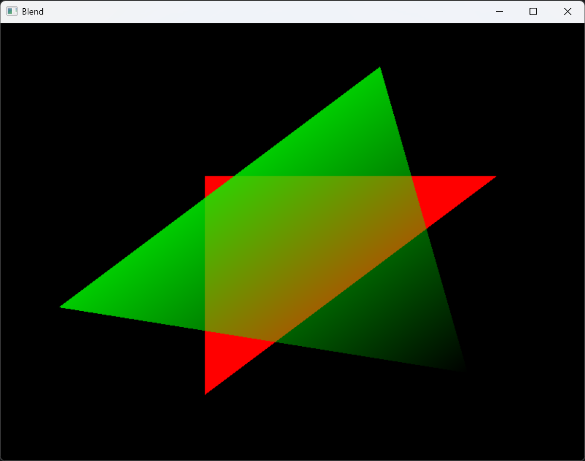

# Blend 示例

## 概述

Blend 示例演示 Alpha 混合 (Alpha Blending) 功能。当渲染透明或半透明物体时，新片元的颜色需要与帧缓冲区中已有的颜色进行混合，以实现透明效果。该示例绘制两个三角形，第一个为不透明红色三角形，第二个为透明绿色三角形 (Alpha 值设为 0.8)，展示半透明合成效果。

## 运行效果



绿色三角形具有透明度，与红色三角形重叠的区域呈现混合后的颜色效果。绿色三角形的 Alpha 值在三个顶点上分别设置为 `0.0`、`0.8`、`0.8`，形成渐变透明度。

## 核心流程

### 1. 启用混合

```cpp
Renderer device(window);
device.enable(State::BLEND);
```

`enable(State::BLEND)` 通知 `OutputMerger` 在合并片元输出时执行 Alpha 混合。底层调用 `m_output_merger->enableBlend()`，设置内部标志位 `m_blend_enabled = true`。

### 2. 定义带透明度的顶点数据

```cpp
std::vector<Vertex> tris(6);
std::vector<std::size_t> ind{ 0, 1, 2, 3, 4, 5 };

// 三角形 1: 红色，完全不透明
tris[0].color = Color(1, 0, 0, 1);   // Alpha = 1.0
tris[1].color = Color(1, 0, 0, 1);
tris[2].color = Color(1, 0, 0, 1);
tris[0].position = { -0.3, -0.3, 0 };
tris[1].position = { 0.7, -0.3, 0 };
tris[2].position = { -0.3, 0.7, 0 };

// 三角形 2: 绿色，半透明 (顶点 Alpha 渐变)
tris[3].color = Color(0, 1, 0, 0.0);  // Alpha = 0.0 (完全透明)
tris[4].color = Color(0, 1, 0, 0.8);  // Alpha = 0.8
tris[5].color = Color(0, 1, 0, 0.8);  // Alpha = 0.8
tris[3].position = { 0.6, 0.6, 0 };
tris[4].position = { 0.3, -0.8, 0 };
tris[5].position = { -0.8, 0.3, 0 };
```

`Color` 的第四个分量 `a` 表示 Alpha 值，范围 `[0.0, 1.0]`。Alpha 值经过光栅化插值后变为逐片元的 Alpha 值，参与混合计算。

### 3. 渲染循环

```cpp
while (window->isRunning()) {
    device.clearFrameBuffer();
    device.beginScene();
    device.draw(tris, ind);
    device.endScene();
    std::this_thread::sleep_for(std::chrono::milliseconds(16));
}
```

注意此处显式调用了 `clearFrameBuffer()` 来清空颜色缓冲区，确保新帧不会积累上一帧的内容。

## Alpha 混合实现原理

SRDR 的 Alpha 混合使用标准透明度混合方程：

### 混合公式

```plaintext
output_color = src_color * src_alpha + dst_color * (1 - src_alpha)
```

其中：

- `src_color` -- 新片元的颜色 (源颜色)
- `src_alpha` -- 新片元的 Alpha 值 (源 Alpha)
- `dst_color` -- 帧缓冲区中已存储的颜色 (目标颜色)

### 输出合并阶段

`OutputMerger::mergeOutputs` 在处理混合时：

```plaintext
if (blend_enabled) {
    Color dst = frame_buffer->getColor(0, x, y);
    float a = fragment_color.a;
    Color blended;
    blended.r = fragment_color.r * a + dst.r * (1.0f - a);
    blended.g = fragment_color.g * a + dst.g * (1.0f - a);
    blended.b = fragment_color.b * a + dst.b * (1.0f - a);
    blended.a = fragment_color.a * a + dst.a * (1.0f - a);
    frame_buffer->writeColor(0, x, y, blended);
}
```

### 渲染顺序的重要性

Alpha 混合要求从后往前绘制透明物体 (画家算法)。在实际应用中，不透明物体应先绘制，透明物体按深度从远到近排序后绘制。当前示例中两个三角形深度相同，因此绘制顺序决定了混合结果。

## 关键技术要点

| 要点 | 说明 |
| --- | --- |
| 混合模式 | 标准 Alpha 混合：`src * src_alpha + dst * (1 - src_alpha)` |
| 顶点 Alpha | Alpha 值在顶点中定义，经过光栅化插值后作用于每个片元 |
| 与深度测试的关系 | 建议混合与深度测试配合使用时，先绘制不透明物体再绘制透明物体 |
| 颜色空间 | 混合在浮点颜色空间中进行，最终转换回 `uint32_t` 写入帧缓冲区 |
