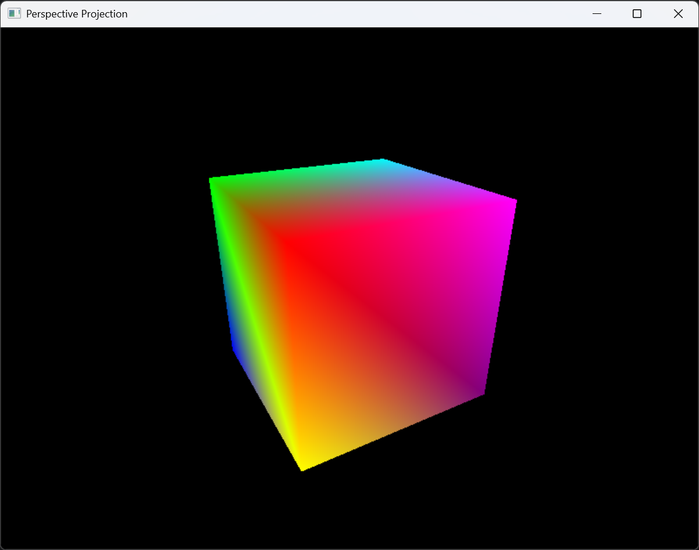

# PerspectiveProjection 示例

## 概述

PerspectiveProjection 示例演示三维场景的透视投影与视图变换。通过自定义顶点着色器，将三维模型从世界空间变换到裁剪空间，生成具有近大远小透视效果的渲染结果。该示例绘制一个旋转的彩色立方体，展示完整的模型-视图-投影 (MVP) 矩阵变换流程。

## 运行效果



一个 8 种颜色的立方体绕 Y 轴匀速旋转。透视投影使立方体呈现近大远小的效果，配合深度测试确保正确的前后遮挡关系。

## 核心流程

### 1. 创建渲染器并启用深度测试

```cpp
Renderer device(window);
device.enable(State::DEPTH_TEST);
```

三维场景的物体存在前后遮挡关系，必须启用深度测试保证渲染正确性。

### 2. 创建透视相机

```cpp
Camera camera(
    Vec3(0, -1, 2),   // 相机位置
    Vec3(0, 0, 0),    // 目标点 (世界原点)
    Vec3(0, 1, 0),    // 上方向
    1.0472f,          // 垂直视场角 60度
    float(width) / float(height),  // 宽高比
    0.1f,             // 近裁剪面
    100.0f            // 远裁剪面
);
```

`Camera` 类封装了视图矩阵和投影矩阵的生成：

- **视图矩阵** (`getViewMatrix`) -- 通过 `transform::lookAt` 函数计算，将世界坐标变换到相机坐标系
- **投影矩阵** (`getProjectionMatrix`) -- 通过 `transform::perspective` 函数计算，将视锥体映射到标准化设备坐标系 (NDC)

### 3. 定义自定义顶点着色器

```cpp
float angle = 0.0f;

device.setVertexShader([&camera, &angle](const VertexInput& in) {
    // 模型矩阵: 绕 Y 轴旋转
    Mat4 model = transform::rotate(angle, { 0.0f, 1.0f, 0.0f });

    // MVP 矩阵: 投影 * 视图 * 模型
    Mat4 mvp = camera.getProjectionMatrix()
             * camera.getViewMatrix()
             * model;

    // 模型坐标 -> 裁剪坐标
    Vec4 clip = mvp * Vec4(in.a_position, 1.0f);

    VertexOutput out;
    out.v_position = clip;
    out.v_world_position = model * Vec4(in.a_position, 1.0f);
    out.v_color = in.a_color;
    return out;
});
```

顶点着色器的核心是 MVP 矩阵变换：

1. **模型矩阵** (Model) -- 将物体从局部坐标系变换到世界坐标系。此处使用绕 Y 轴旋转矩阵
2. **视图矩阵** (View) -- 将世界坐标变换到相机坐标系。由 `Camera::getViewMatrix` 提供
3. **投影矩阵** (Projection) -- 将相机坐标变换到裁剪坐标系 (Clip Space)。由 `Camera::getProjectionMatrix` 提供

### 4. 定义立方体顶点

```cpp
std::vector<Vertex> verts = {
    // 位置                          // 颜色
    { { -0.5f, -0.5f, -0.5f }, {}, Color(1, 0, 0), {} },
    { { 0.5f, -0.5f, -0.5f },  {}, Color(0, 1, 0), {} },
    { { 0.5f, 0.5f, -0.5f },   {}, Color(0, 0, 1), {} },
    { { -0.5f, 0.5f, -0.5f },  {}, Color(1, 1, 0), {} },
    { { -0.5f, -0.5f, 0.5f },  {}, Color(1, 0, 1), {} },
    { { 0.5f, -0.5f, 0.5f },   {}, Color(0, 1, 1), {} },
    { { 0.5f, 0.5f, 0.5f },    {}, Color(1, 1, 1), {} },
    { { -0.5f, 0.5f, 0.5f },   {}, Color(0.5f, 0, 0.5f), {} },
};
```

立方体 8 个顶点各赋予不同颜色，未设置法线和纹理坐标。

### 5. 定义索引缓冲区

```cpp
std::vector<std::size_t> idx = {
    4, 5, 6, 4, 6, 7,  // 正面 (+Z)
    1, 0, 3, 1, 3, 2,  // 背面 (-Z)
    7, 6, 2, 7, 2, 3,  // 右面 (+X)
    0, 1, 5, 0, 5, 4,  // 左面 (-X)
    5, 1, 2, 5, 2, 6,  // 顶面 (+Y)
    0, 4, 7, 0, 7, 3,  // 底面 (-Y)
};
```

36 个索引构成 12 个三角形，覆盖立方体 6 个面。

### 6. 渲染循环

```cpp
while (window->isRunning()) {
    device.clearFrameBuffer();
    device.beginScene();
    device.draw(verts, idx);
    device.endScene();
    angle += 0.025f;  // 每帧增加旋转角度
    std::this_thread::sleep_for(std::chrono::milliseconds(16));
}
```

每帧更新 `angle` 变量，顶点着色器中的模型矩阵随之变化，产生立方体旋转动画。

## MVP 矩阵变换详解

### 变换流水线

```plaintext
顶点坐标 (Model Space)
    |
    v  [Model Matrix]
顶点坐标 (World Space)
    |
    v  [View Matrix]
顶点坐标 (View Space / Camera Space)
    |
    v  [Projection Matrix]
顶点坐标 (Clip Space)
    |
    v  [Perspective Divide]  (由 PrimitiveAssembler 执行)
顶点坐标 (NDC)
    |
    v  [Viewport Transform]  (由 PrimitiveAssembler 执行)
屏幕坐标 (Screen Space)
```

### 透视投影矩阵

透视投影矩阵由 `transform::perspective` 函数生成：

```plaintext
(fov: 60度, aspect: 宽高比, near: 0.1, far: 100.0)
```

该矩阵将视锥体变换到齐次裁剪空间，其中 Z 值映射到 `[-1, 1]` 范围，X/Y 值根据视场角和宽高比进行缩放，产生透视收缩效果。

## 关键技术要点

| 要点 | 说明 |
| --- | --- |
| 自定义着色器 | 通过 `setVertexShader` 注入 lambda 表达式，捕获外部变量 (相机、角度) |
| MVP 顺序 | 矩阵乘法顺序为 `Projection * View * Model`，列向量左乘 |
| 透视除法 | `PrimitiveAssembler` 自动执行透视除法 (X/w, Y/w, Z/w) |
| 视口变换 | NDC 坐标 `[-1, 1]` 自动映射到屏幕像素坐标 |
| 深度测试 | 必须启用深度测试以正确处理立方体面的前后遮挡 |
